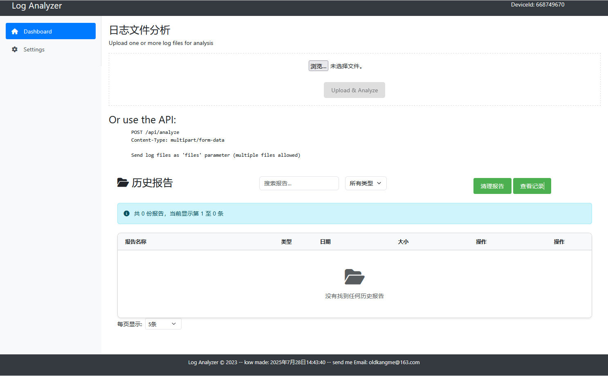
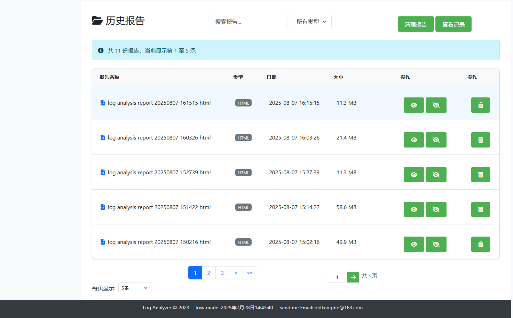
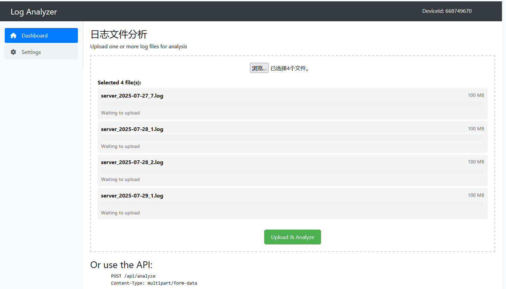
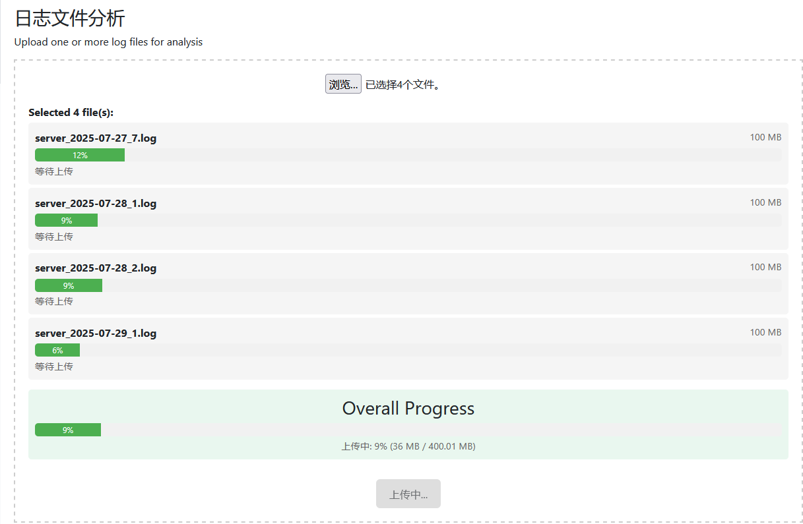
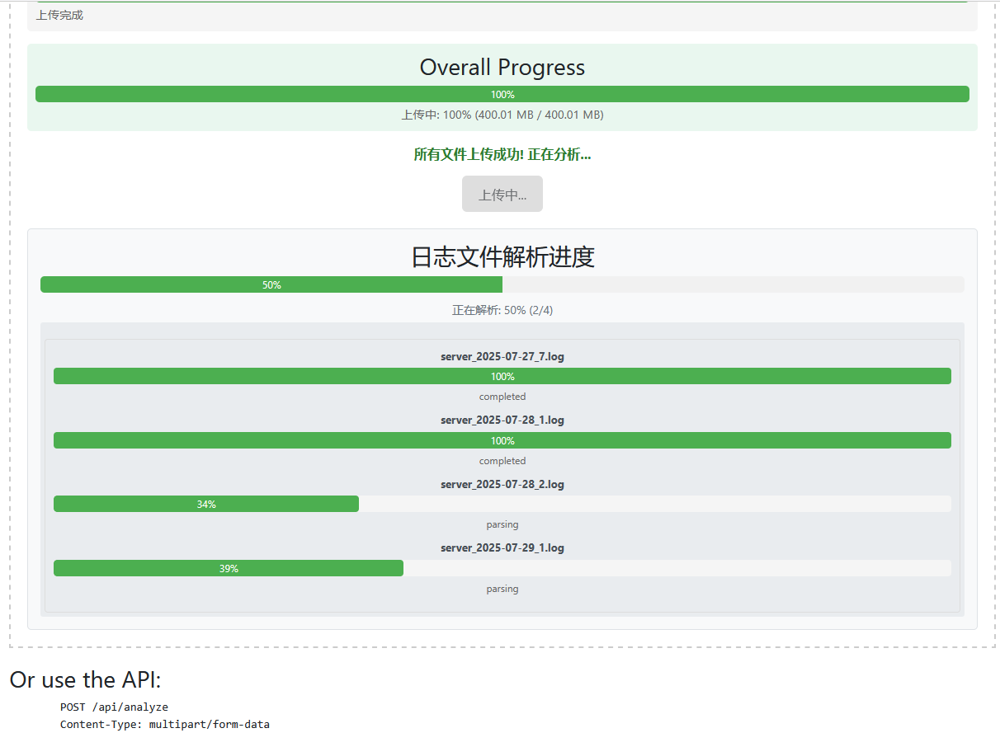
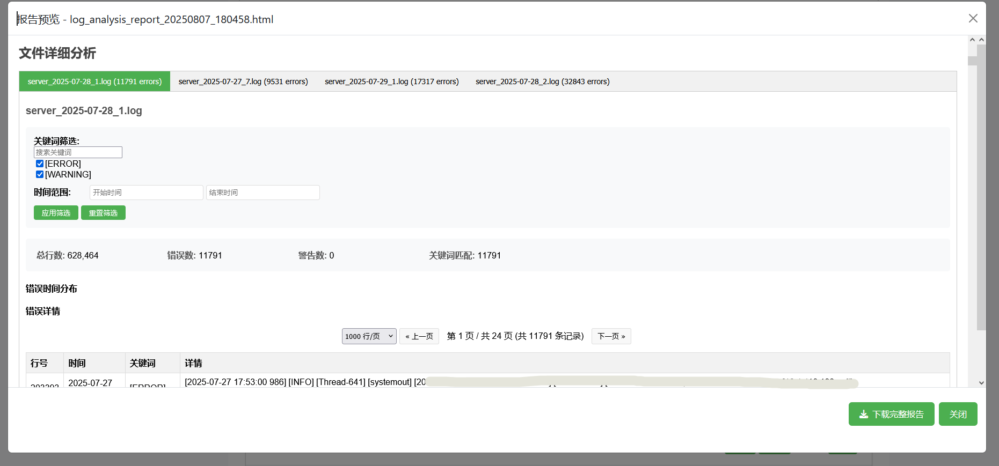
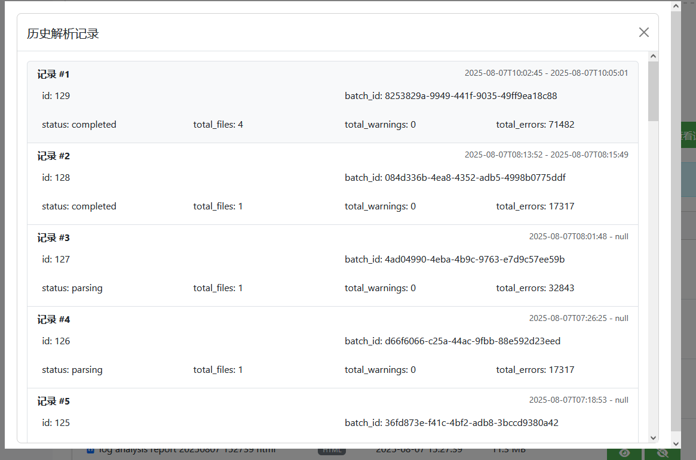
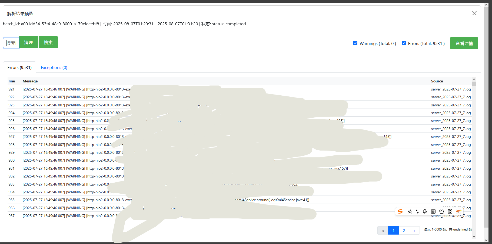
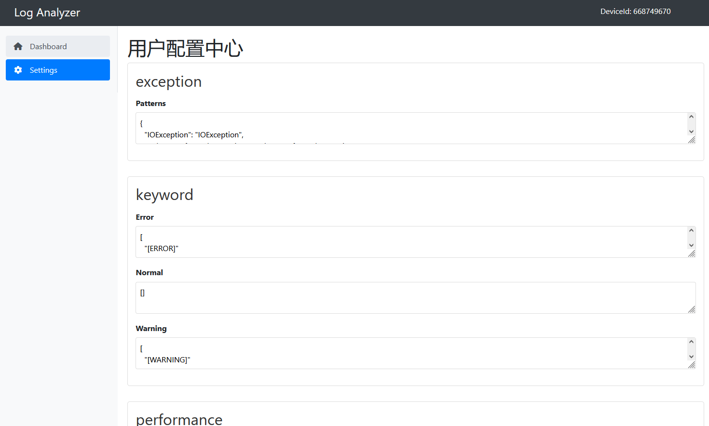

# LogfileAnalysis 🚀

> A brief one-liner describing your project.

**Key Features**:
- 📦 Installation
- 🛠 Usage
- ✅ screenshots/GIFs
- 🤝 Contributing
- 📄 License

---

## 📦 Installation
        
### Clone the repo
    git clone https://github.com/yourusername/project-name.git
    cd project-name
### Create a .env file
    virtualenv .env
### Install dependencies
    pip install -r requirements.txt

### For development:
    pip install -r dev-requirements.txt
    
### Migrate Model
    set Flask_db = main.py
    flask db init
    flask db migrate 
    flask db upgrade 
### run 
    python main.py    

---
    
# 🛠 Usage

## Basic Example
    Or use the API:

        POST /api/analyze
        Content-Type: multipart/form-data

        Send log files as 'files' parameter (multiple files allowed)
    

# 📂 Project Structure

    project/
    |   .gitignore
    |   .python-version
    |   LICENSE
    |   main.py                              --主程序
    |   pyproject.toml
    |   README.md
    |   uv.lock            
    +---imges
    +---log_analyzer
    |   |   extensions.py
    |   |   handle_request.py
    |   |   log_analyzer_template.py        --日志文件解析
    |   |   log_parser.py
    |   |   models.py                       -- 模型
    |   |   requirements.txt
    |   |   servers.py                      -- 数据库操作
    |   |   __init__.py
    |   |   
    |   +---blueprint
    |   |   |   historys.py
    |   |   |   __init__.py
    |   |   |   
    |   +---config                          -- 基础配置包
    |   |   |   base.py
    |   |   |   development.py
    |   |   |   production.py
    |   |   |   testing.py
    |   |   |   __init__.py
    |   |           
    |   +---reports
    |   +---static
    |   |   +---css     
    |   |   \---js       
    |   +---templates
    |   |       base.html
    |   |       cleanup.html
    |   |       error.html
    |   |       history.html
    |   |       index.html
    |   |       report_template.html
    |   |       results.html
    |   |       settings.html
    |   |       
    |   +---uploads
    |   +---utils                        -- 工具包
    |   |   |   cleans.py
    |   |   |   combines.py
    |   |   |   errors.py
    |   |   |   files.py
    |   |   |   __init__.py
    |           
    +---migrations
    +---reports     
    +---uploads

# 🎨screenshots/GIFs

        
 

# 🤝 Contributing

    Fork the repository.

    Create a branch (git checkout -b feature/awesome-feature).

    Commit changes (git commit -m 'Add awesome feature').

    Push to the branch (git push origin feature/awesome-feature).

    Open a Pull Request.

# 📄 License

    Distributed under the MIT License. See LICENSE for details.    